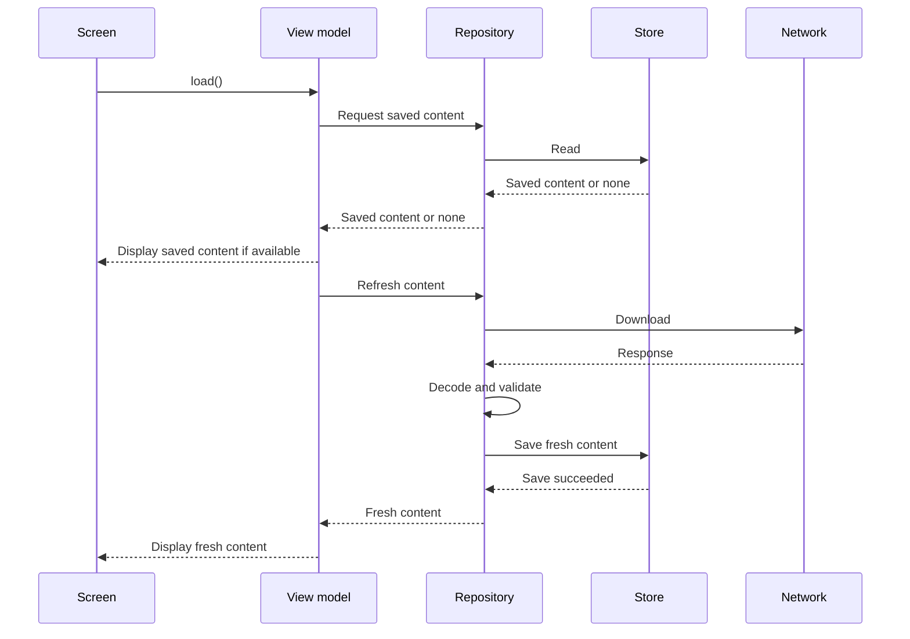
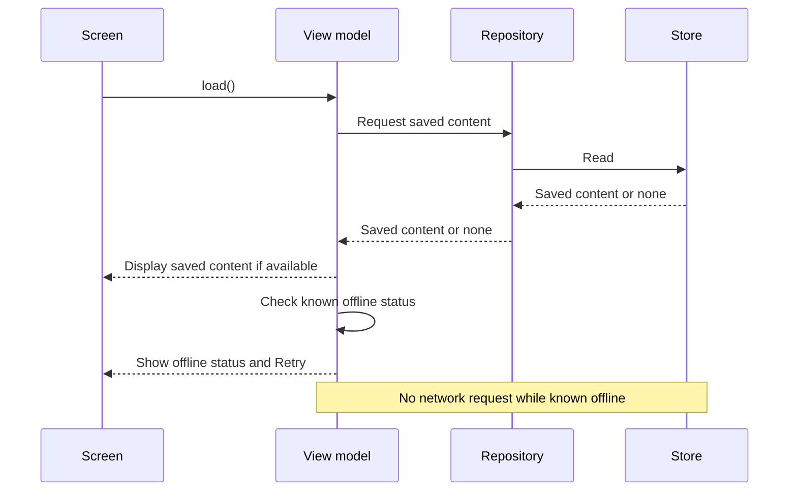

# Person Browser

A small native iPhone app for browsing records and navigating relatives, including previously loaded content offline.

## Getting started

1. **Clone the repository** on your Mac:
  ```sh
   git clone https://github.com/mcmurrym/person-browser.git
   cd person-browser
  ```
2. **Install Xcode 26 or 27 if needed.** Download Xcode from the [Mac App Store](https://apps.apple.com/app/xcode/id497799835) or [Apple Developer Downloads](https://developer.apple.com/download/all/). Open it once and complete any first-launch component installation. Development and validation used **Xcode 27.0 RC**; Xcode 26 has not been separately verified.
3. **Open the project in Xcode.** Choose **File → Open** and select `person-browser.xcodeproj` from the cloned repository.
4. **Install an iPhone simulator runtime if needed.** In **Xcode → Settings → Components**, download an **iOS 26.0 or newer** simulator runtime supported by your Xcode version. You can also use the download option in Xcode’s run destination selector. See [Apple’s simulator installation guide](https://developer.apple.com/documentation/xcode/downloading-and-installing-additional-xcode-components).
5. **Run the app.** Select the **person-browser** scheme and an installed **iPhone simulator** in the toolbar, then press **Run (⌘R)**. Use an internet connection for the first launch to download people and portraits; successfully saved content remains available offline.

No third-party packages, API keys, or app account are required. The project uses **Swift 6 language mode**. Running on a physical iPhone requires selecting your own signing team.

### Run tests

Use **Product → Test (⌘U)** to run the tests. Unit tests use bundled fixtures and isolated temporary SwiftData databases. The UI browsing test uses the public sample service for its initial online phase.

## Decisions and tradeoffs

- Files organized by feature. Standard Apple navigation and layouts keep the app familiar. `*Screen` names identify full screens; `*View` names identify reusable pieces and make the project easier to search.
- MVVM with a repository**.** View models own presentation and loading state; the repository coordinates networking and persistence. I deliberately avoid `@Query` (from SwiftData) in screens to keep those responsibilities separate. The tradeoff is explicitly loading data and assigning updated state.
- Separate response, storage, and domain models. The agent chose this separation to keep service and persistence details out of the UI. I see its value, but changing a field can require updating three representations and their mappings. I might consider a macro or other code-gen if I were to keep a tri-model design
- SwiftData for durable storage. It provides a queryable schema and direct person lookup by ID. Saved lists, opened profiles, and portrait bytes survive process termination. A small custom image loader persists originals rather than relying disk cache. There are no third-party dependencies.
- Explicit loading and failure states. Saved content appears immediately and stays visible if refreshing fails. Empty results are distinct from errors. View models cancel work when screens leave; stale tasks cannot overwrite newer results. Swift 6 checks concurrency boundaries, with storage and decoding work kept off the main actor.


## Loading flow


### Successful online loading sequence

Saved content appears first when available; the network refresh still follows.




### Known-offline loading sequence

Read saved content, then report that the device is offline without making a network request.




With saved content, the offline message is a nonblocking warning. Without content, the screen shows an error and Retry. When a network path returns, the active view model automatically refreshes. These diagrams assume the store read succeeds; later loads skip that read when content is already displayed.

## Known gaps and what to do differently

- I am okay that the agent built the majority of the app, but if I am imagining this is an app I am working on as a team, I'd ensure we have patterns we agree on which include guardrails for the agent. 
- I'd set a cyclomatic complexity rule (with swiftlint), this keeps an agent from running away on a function and making it overly complicated. Which in turn makes the code simpler to understand for both agent and human alike. I'm  not sure any function is too complex in this sample app, but the agent can ruin things fast.
- The app is complete per the assignment, but lacks ui appeal, and is especially unpolished around loading and offline.


## With 100,000 people

- To support endless amounts of data I'd first work with the backend side to establish a pagination contract for the scrolling experience.
- Also with the backend plan indexing fields and a search/filtering api, it would be needed with a list that large. Too big a list to scroll to find what you are looking for, and you want results quickly.
- SwiftData/CoreData is actually purposed for large datasets, I'd keep to that.
- I am not up-to-date on the scale-ability of Lists { ForEach { } } I've not had problems with hundreds of rows, and I can't imagine someone would scroll thousands of rows, but I'd want to make sure that the mechanism being used can handle the volume. It is UITableView backed, but I know it's had problems in the past.
- With a paginated api, I'd likely create an automatic load more when offset *n* was reached with a load more/loading footer at the bottom of the list, but hoping the typical user doesn't reach it.
- Images are persisted right now, depending on the variability and size of the average image, it may be better to cache images instead of persisting them as it could take up a lot of space on disk.


## With another day

- Custom transition animations
- Clean-up offline UI
- Add search/filter/sort
- In the ViewModels we have a duplication where it is probably worth deduplicating. We query the store, then we query the network. this adds complexity to the view models that I do not like. I'm not married to DRY (Don't Repeat Yourself) in coding, sometimes it can make things more complicated, but in this case, we have a pattern of how we load data, it should load through the same path. Loading through the same mechanism should abstract the complexity out of the ViewModels, right now they are too involved with 'how' data is fetched in my opinion.
- Research more into the tri-model design


## Time and AI assistance

Approximately **3 hours**, I charged the agent with creating the app, I gave it some specific instruction

- How to use SwiftData (in particular, do not use @Query).
- Use my preferred technique of `DataLoadState`. `DataLoadState` itself provides the agent affordance to show loading UI and error/retry UX and it took that up no problem.
- Stick with standard SwiftUI components initially.
- Use MVVM for the UI system
- And a simple controller system (repository) with a basic http client for data fetch

The agent built for about 15 minutes. I spent the rest of the time polishing, inspecting, and improving things lacking or I didn't like for example: The agent added a ui update ticker `@State var retry: Int = 0` This is pretty poor form most of the time. I had the agent update the code to use direct view model interactions instead.